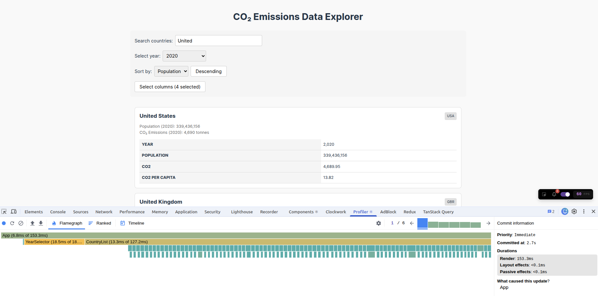
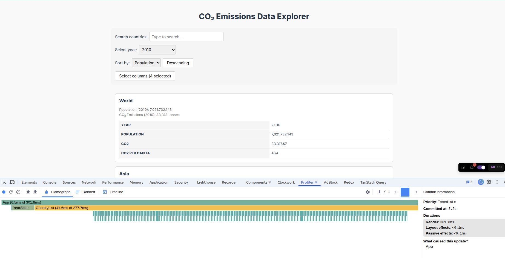

# Performance Optimization Report

## Baseline Measurements

### Interaction A: Sort countries

- **Commit duration**: 2.1 s
- **Render duration**: 324.1 ms
- **Screenshot**: 

### Interaction B: Search countries

- **Commit duration**: 2.7 s
- **Render duration**: 153.3 ms
- **Screenshot**: 

### Interaction C: Change year

- **Commit duration**: 3.2 s
- **Render duration**: 301.8 ms
- **Screenshot**: 

### Interaction D: Toggle column

- **Commit duration**: 1.7 s
- **Render duration**: 338.5 ms
- **Screenshot**: 